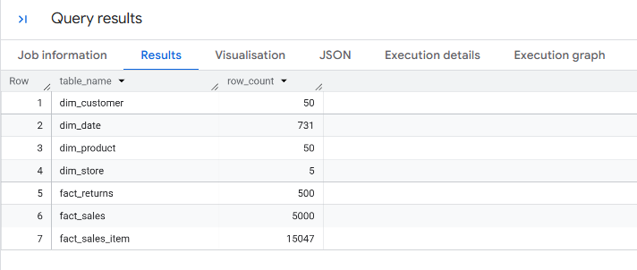
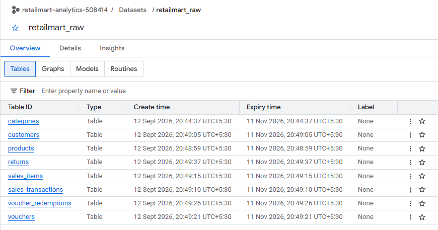
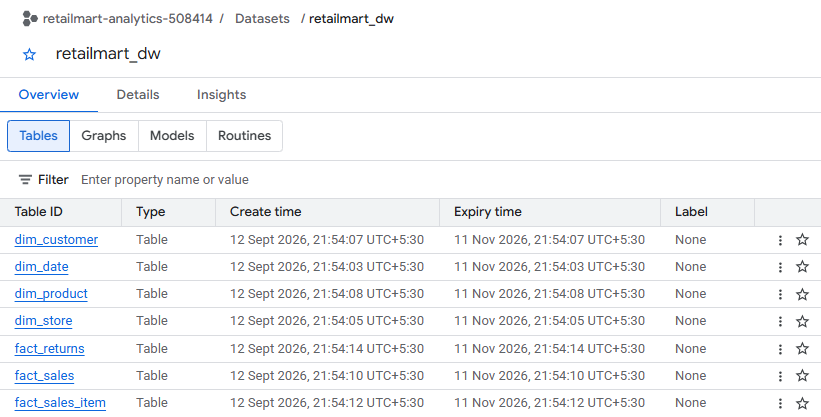
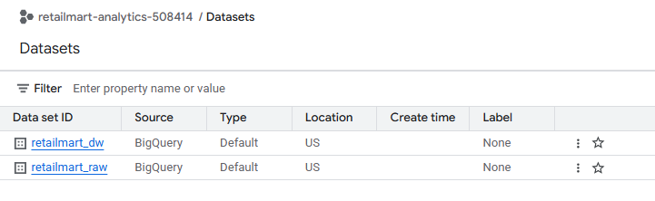
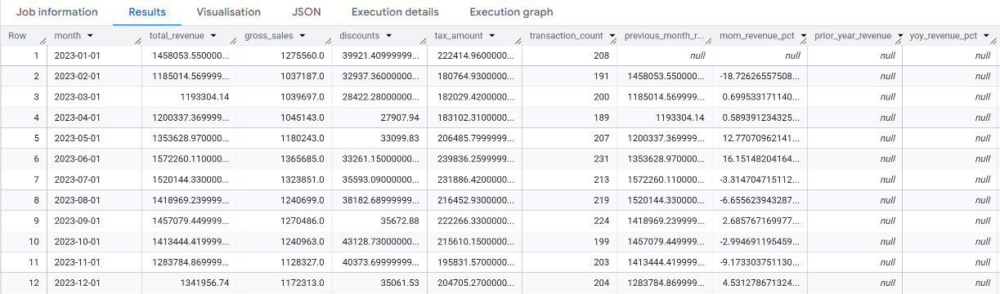
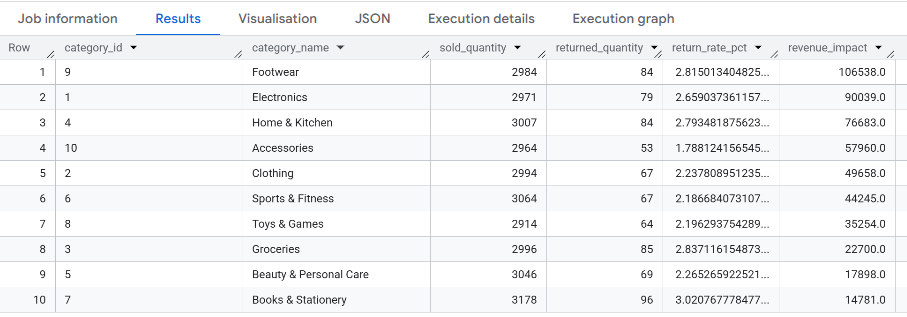
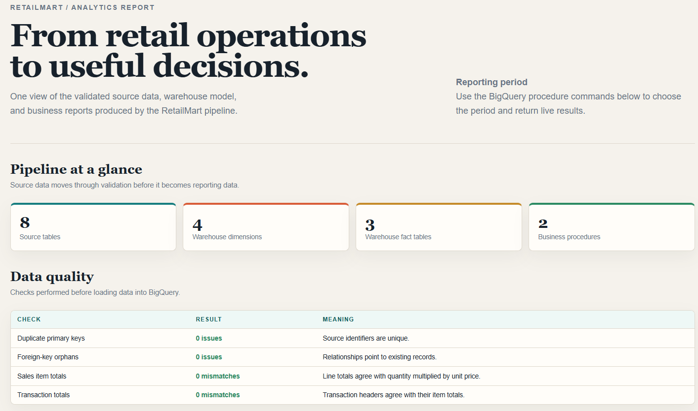
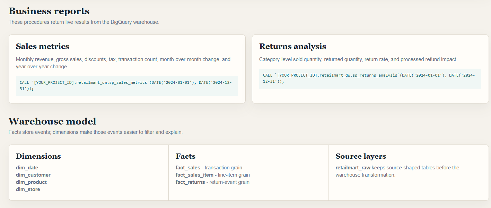
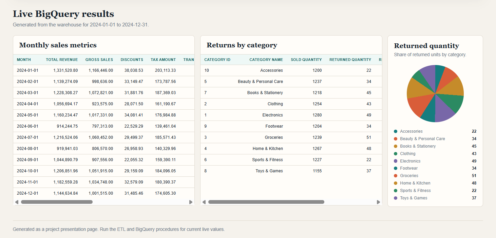

# RetailMart Analytics Pipeline

An ETL pipeline that loads RetailMart CSV files into MySQL, extracts the MySQL
data with Python, validates and transforms it, loads raw tables into BigQuery,
and builds a reporting warehouse with sales and returns procedures.

## Pipeline

```text
CSV files
  |
  V
MySQL
  |
  V
Python ETL: extract, transform, validate ->  BigQuery raw tables
                              |
                              v
BigQuery warehouse: dimensions and facts
  |
  v
Stored procedures
  |
  v
Reporting
```

## Requirements

- Python 3.10+
- Google Cloud SDK (`gcloud` and `bq`)
- A Google Cloud project with BigQuery enabled; billing is not required for
  this billing-free implementation
- MySQL Server

## Google Cloud Project and BigQuery Datasets

Create or select a Google Cloud project before running the pipeline. You can
create a project in the Google Cloud Console, or use the CLI if you have the
required organization permissions

If the project already exists, skip the `gcloud projects create` command.
This project uses the billing-free BigQuery SQL configuration, so no billing
account is required for the documented pipeline.

Use the same project ID everywhere in this README and in
`Python_ETL_Pipeline/.env`:

```powershell
gcloud auth application-default login
gcloud projects create YOUR_PROJECT_ID --name="RetailMart Analytics"
gcloud config set project YOUR_PROJECT_ID
bq mk --location=US YOUR_PROJECT_ID:retailmart_raw
bq mk --location=US YOUR_PROJECT_ID:retailmart_dw
gcloud services enable bigquery.googleapis.com
```

The project contains two datasets:

- `retailmart_raw` - source-shaped tables loaded by the Python ETL.
- `retailmart_dw` - dimensional warehouse tables, facts, and analytics procedures.

The ETL also creates `retailmart_raw` when it does not exist. The explicit
`bq mk` commands make the required project and dataset setup visible and allow
you to choose the dataset location before loading data. If a dataset already
exists, `bq mk` reports that it exists; continue without recreating it.

## Setup

From the repository root:

```powershell
python -m pip install -r .\Python_ETL_Pipeline\requirements.txt
Remove-Item -Recurse -Force .\venv
python -m venv .\venv
.\venv\Scripts\Activate.ps1
```

Create `Python_ETL_Pipeline/.env`:

```env
GCP_PROJECT_ID=YOUR_PROJECT_ID
BQ_DATASET=retailmart_raw
BQ_LOCATION=US
LOG_LEVEL=INFO

# Required for --source mysql
MYSQL_HOST=localhost
MYSQL_PORT=3306
MYSQL_DATABASE=retailmart
MYSQL_USER=retailmart_user
MYSQL_PASSWORD=YOUR_MYSQL_PASSWORD
```

## Why Keep a BigQuery Raw Dataset?

The source of this project is MySQL, but the implemented architecture first
migrates the source tables into BigQuery and then builds the warehouse from
`retailmart_raw`. Keeping the raw layer is useful because it:

- preserves a BigQuery copy of the source at ingestion time;
- separates extraction from warehouse transformations;
- allows the warehouse to be rebuilt without reconnecting to MySQL; and
- provides a stable, auditable input for repeatable analytics.

It is technically possible to query MySQL directly through a federated query
or another integration and skip the BigQuery raw dataset. That approach can
reduce storage duplication, but it makes analytics dependent on MySQL
availability and network access, and can increase query latency. This project
uses the raw BigQuery layer because its purpose is MySQL-to-BigQuery migration
followed by BigQuery business analytics.

## Run the ETL

The main migration workflow is CSV -> MySQL -> BigQuery. The CSV files are
loaded into MySQL first; the production ETL then reads from MySQL. It does not
load the CSV files directly into BigQuery.

Create the schema in `MySQL_ER_And_Schema/Schema/mysql_schema.sql`, load the source CSV files into MySQL using the instructions below, then run:

Create the database and tables as MySQL root:

```powershell
$mysql = "C:\Program Files\MySQL\MySQL Server 9.7\bin\mysql.exe"
Get-Content .\MySQL_ER_And_Schema\Schema\mysql_schema.sql -Raw | & $mysql -u root -p
```
Create the MySQL user and grant access as root:

```powershell
CREATE USER IF NOT EXISTS 'retailmart_user'@'localhost'
IDENTIFIED BY 'YOUR_MYSQL_PASSWORD';

ALTER USER 'retailmart_user'@'localhost'
IDENTIFIED BY 'YOUR_MYSQL_PASSWORD';

GRANT ALL PRIVILEGES ON retailmart.* TO 'retailmart_user'@'localhost';
FLUSH PRIVILEGES;
```

### Load CSV files into MySQL

Start MySQL with local file loading enabled. Update the executable path if
MySQL is installed elsewhere:

```powershell
$mysql = "C:\Program Files\MySQL\MySQL Server 9.7\bin\mysql.exe"
& $mysql -u root -p -e "SET GLOBAL local_infile = 1;"
& $mysql --local-infile=1 -u root -p
```

Run this SQL in the MySQL prompt. Load the tables in this order because of
their foreign-key dependencies:

```sql
SHOW DATABASES;
USE retailmart;

LOAD DATA LOCAL INFILE 'C:\Users\vaibhavi\Desktop\data_pipeline\Sample_Data\categories.csv'
INTO TABLE categories
FIELDS TERMINATED BY ',' ENCLOSED BY '"' IGNORE 1 ROWS;

LOAD DATA LOCAL INFILE 'C:\Users\vaibhavi\Desktop\data_pipeline\Sample_Data\products.csv'
INTO TABLE products
FIELDS TERMINATED BY ',' ENCLOSED BY '"' IGNORE 1 ROWS;

LOAD DATA LOCAL INFILE 'C:\Users\vaibhavi\Desktop\data_pipeline\Sample_Data\customers.csv'
INTO TABLE customers
FIELDS TERMINATED BY ',' ENCLOSED BY '"' IGNORE 1 ROWS;

LOAD DATA LOCAL INFILE 'C:\Users\vaibhavi\Desktop\data_pipeline\Sample_Data\sales_transactions.csv'
INTO TABLE sales_transactions
FIELDS TERMINATED BY ',' ENCLOSED BY '"' IGNORE 1 ROWS;

LOAD DATA LOCAL INFILE 'C:\Users\vaibhavi\Desktop\data_pipeline\Sample_Data\sales_items.csv'
INTO TABLE sales_items
FIELDS TERMINATED BY ',' ENCLOSED BY '"' IGNORE 1 ROWS;

LOAD DATA LOCAL INFILE 'C:\Users\vaibhavi\Desktop\data_pipeline\Sample_Data\vouchers.csv'
INTO TABLE vouchers
FIELDS TERMINATED BY ',' ENCLOSED BY '"' IGNORE 1 ROWS;

LOAD DATA LOCAL INFILE 'C:\Users\vaibhavi\Desktop\data_pipeline\Sample_Data\voucher_redemptions.csv'
INTO TABLE voucher_redemptions
FIELDS TERMINATED BY ',' ENCLOSED BY '"' IGNORE 1 ROWS;

LOAD DATA LOCAL INFILE 'C:\Users\vaibhavi\Desktop\data_pipeline\Sample_Data\returns.csv'
INTO TABLE returns
FIELDS TERMINATED BY ',' ENCLOSED BY '"' IGNORE 1 ROWS;
```

Replace `C:/path/to/data_pipeline` with the absolute path to this repository.
Check `SHOW WARNINGS;` after each load. Verify the row counts before running
the ETL:

```sql
SELECT 'categories' AS table_name, COUNT(*) AS row_count FROM categories
UNION ALL SELECT 'products', COUNT(*) FROM products
UNION ALL SELECT 'customers', COUNT(*) FROM customers
UNION ALL SELECT 'sales_transactions', COUNT(*) FROM sales_transactions
UNION ALL SELECT 'sales_items', COUNT(*) FROM sales_items
UNION ALL SELECT 'vouchers', COUNT(*) FROM vouchers
UNION ALL SELECT 'voucher_redemptions', COUNT(*) FROM voucher_redemptions
UNION ALL SELECT 'returns', COUNT(*) FROM returns;
```

Exit MySQL with `exit;` before running PowerShell commands.

Run the ETL:

```powershell
python .\Python_ETL_Pipeline\etl_pipeline.py --source mysql
```

The ETL validates duplicate keys, foreign-key relationships, line totals, and
transaction totals before loading the eight source tables into `retailmart_raw`.

The script also supports `--source csv` for an optional local validation test,
but that mode bypasses MySQL and is not the documented migration workflow.

## Build the BigQuery Warehouse

The SQL files currently use the project ID `retailmart-analytics-508414`.
Replace that ID in the BigQuery SQL files if your project uses a different ID;
it must match `GCP_PROJECT_ID` in `.env` and the project used to create both
datasets. The warehouse SQL reads from `retailmart_raw` and writes to
`retailmart_dw`.

Run the executable warehouse build and procedures after the ETL succeeds. The
warehouse build drops and recreates only its warehouse tables; it does not
drop the whole warehouse dataset:

```powershell
Get-Content .\BigQuery_Warehouse\warehouse_schema.sql -Raw |
  bq query --use_legacy_sql=false
Get-Content .\BigQuery_Warehouse\build_warehouse.sql -Raw |
  bq query --use_legacy_sql=false
Get-Content .\SQL_Procedures\business_analytics_procedures.sql -Raw |
  bq query --use_legacy_sql=false
```

`warehouse_schema.sql` documents the intended warehouse table contract and is
not part of the executable build. The executable table build is in
`build_warehouse.sql`, followed by the procedures. This creates the
`retailmart_dw` star schema and the procedures
`sp_sales_metrics` and `sp_returns_analysis`.

## Deliverables

### 1. MySQL Schema and ER Diagram

- `MySQL_ER_And_Schema/Schema/mysql_schema.sql` - normalized MySQL schema.
- `MySQL_ER_And_Schema/ER_Diagram/` - Mermaid, Graphviz, and HTML diagrams.

Open the HTML ER diagram from the repository root:

```powershell
Start-Process .\MySQL_ER_And_Schema\ER_Diagram\mysql_er_diagram.html
```


### 2. Python ETL Pipeline

- `Python_ETL_Pipeline/etl_pipeline.py` - extraction, transformation,
  validation, and BigQuery loading.
- `Python_ETL_Pipeline/requirements.txt` - Python dependencies.
- `Sample_Data/` - CSV source data.



### 3. BigQuery Warehouse

- `BigQuery_Warehouse/warehouse_schema.sql` - warehouse table contract.
- `BigQuery_Warehouse/build_warehouse.sql` - raw-to-warehouse transformation.
- `retailmart_raw` - raw source tables.
- `retailmart_dw` - analytical dimensions and fact tables.







### 4. SQL Business Analytics

- `SQL_Procedures/business_analytics_procedures.sql` - sales and returns
  procedures.
- `sp_sales_metrics` - sales metrics by month.
- `sp_returns_analysis` - returns and refund impact by category.






### 5. HTML Analytics Report

- `Report/generate_report.py` - generates the report from live BigQuery results.
- `Report/retailmart_analytics_report.html` - browser-renderable report.







## Generate the Report

The report reads current results from BigQuery for the requested date range:

```powershell
python .\Report\generate_report.py --start-date 2024-01-01 --end-date 2024-12-31
Start-Process .\Report\retailmart_analytics_report.html
```

## Project Structure

| Path | Purpose |
| --- | --- |
| `Sample_Data/` | CSV source data |
| `Python_ETL_Pipeline/etl_pipeline.py` | Extract, transform, validate, and load |
| `MySQL_ER_And_Schema/Schema/mysql_schema.sql` | MySQL schema |
| `MySQL_ER_And_Schema/ER_Diagram/` | Mermaid, Graphviz, and HTML ER diagrams |
| `BigQuery_Warehouse/` | BigQuery warehouse DDL and build SQL |
| `SQL_Procedures/` | Sales and returns procedures |
| `Report/` | Report generator and generated HTML report |

## Notes

- The warehouse uses date, customer, product, and store dimensions with sales,
  sales-item, and returns fact tables.
- `store_id` is retained from the source because no store master table is provided.
